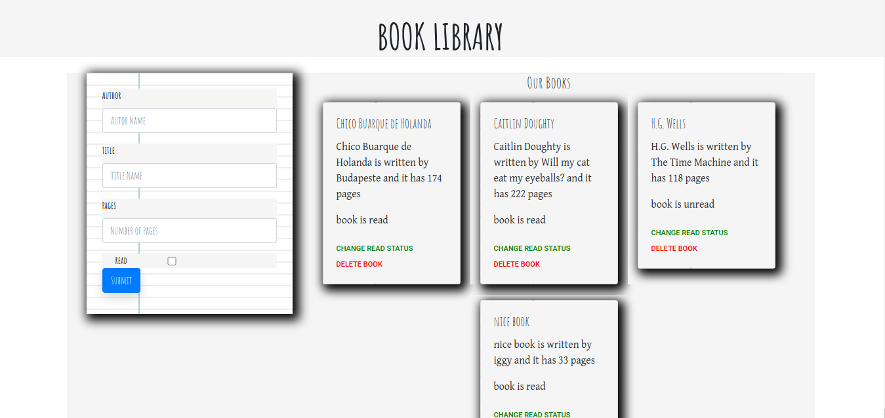

# Library

A simple book library app created with javascript

## Live demo

[live demo](https://shielded-oasis-34342.herokuapp.com/login)

- Screenshot



## Built With

- Javascript
- HTML
- CSS
- Bootstrap


## Getting Started 

## Prerequisites

    Any supporting CSS3 and HTML5 browser

## Install
    No installation applicable

1. clone the repository

```bash
# Clone this repository
$ git clone https://github.com/ignatius22/library.git

# Go into the repository
$ cd library


# run url on your preffered browser


## Authors

👤 **Ignatius Sani**

- Github: [ignatius22](https://github.com/ignatius22)
- Twitter: [@Iggy_code](https://twitter.com/iggy_code)
- Linkedin: [linkedin](https://www.linkedin.com/in/ignatiussani)


## 🤝 Contributing

Contributions, issues and feature requests are welcome!

Feel free to check the <a href="https://github.com/ignatius22/library/issues" target="_blank">issues page</a>.

## Show your support

Give a ⭐️ if you like this project!

## Acknowledgments
 
- <a href="https://www.microverse.org/" target="_blank">Microverse</a>

